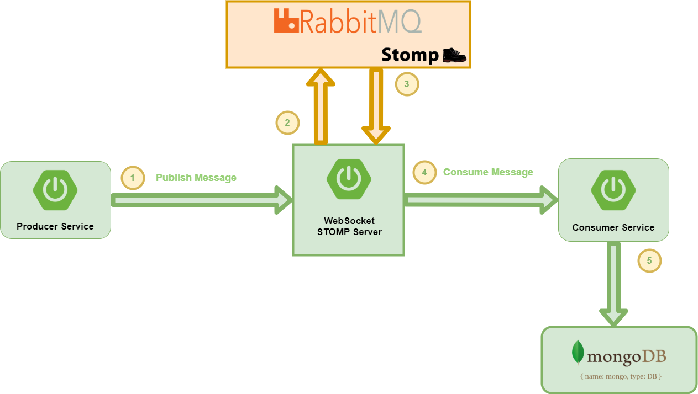
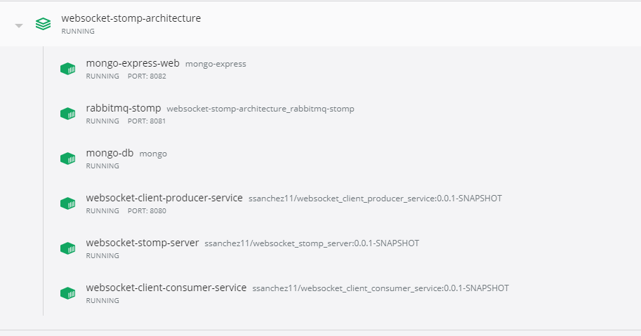
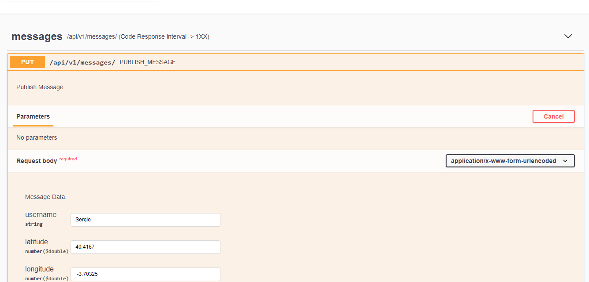
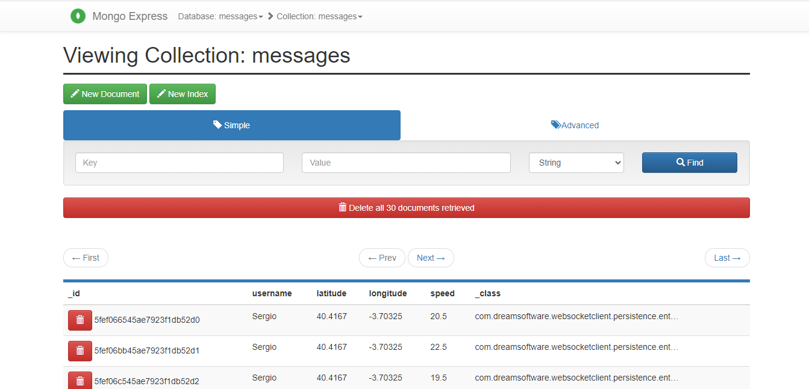
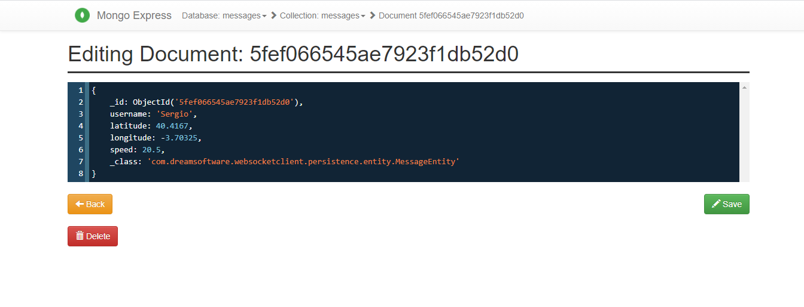
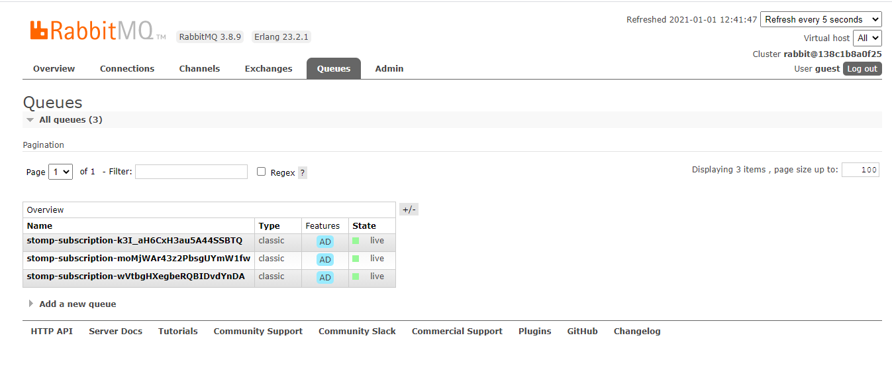

# An approach to communication between microservices based on WebSocket / Stomp

## Used technology

* Spring Boot 2.3.5 / Apache Maven 3.6.3.
* Spring Boot Starter Web.
* Spring Boot Starter Reactor Netty.
* Springdoc OpenApi UI.
* Mapstruct.
* Lombok.
* Spring Boot Starter Websocket.
* Spring Messaging.
* Spring Boot Starter Data MongoDB.

## Running Applications as Docker containers.

### Rake Tasks

The available tasks are detailed below (rake --task)

| Task | Description |
| ------ | ------ |
| check_deployment_file_task | Check Deployment File |
| check_docker_task | Check Docker and Docker Compose Task |
| cleaning_environment_task | Cleaning Evironment Task |
| deploy | Deploys the Websocket STOMP architecture and laun... |
| login | Authenticating with existing credentials |
| start | Start Containers |
| status | Status Containers |
| stop | Stop Containers |
| undeploy | UnDeploy Websocket STOMP architecture |

To start the platform make sure you have Ruby installed, go to the root directory of the project and run the `rake deploy` task, this task will carry out a series of preliminary checks, discard images and volumes that are no longer necessary and also proceed to download all the images and the initialization of the containers.

### Containers Ports

In this table you can view the ports assigned to each service to access to the Web tools or something else you can use to monitoring the flow.

| Container | Port |
| ------ | ------ |
| MongoDB Express | localhost:8082 |
| Rabbit MQ - Stomp Dashboard | localhost:8081 |
| Microservice Producer OpenAPI Swagger | localhost:8088 |

## Some screenshots

As follow, I include some images that help us to understand the performance of each part of system

